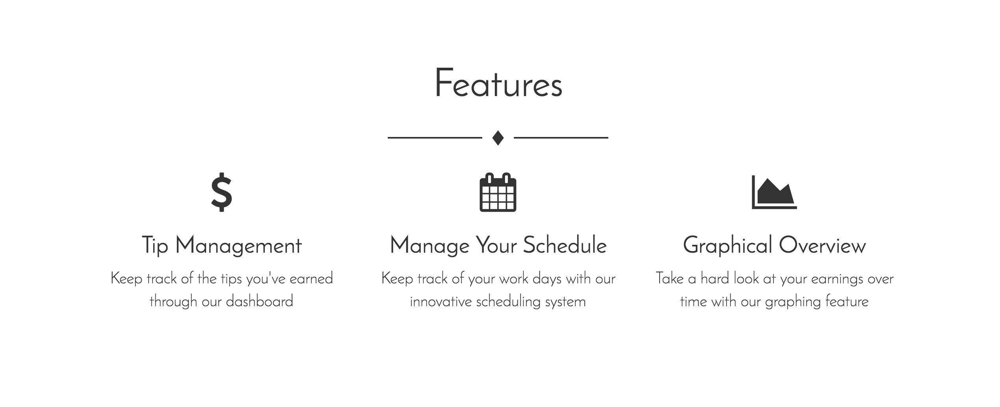
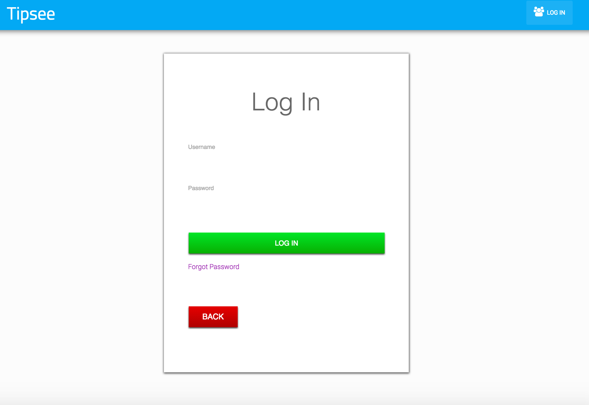
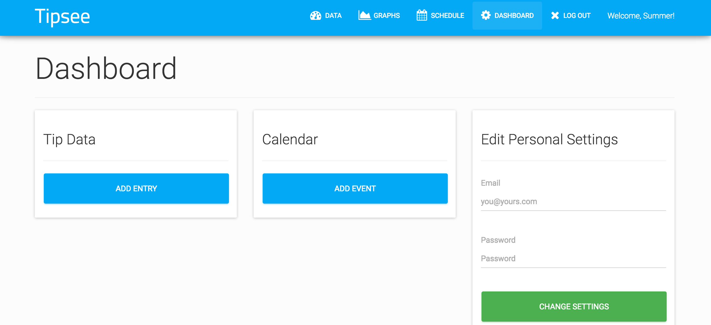
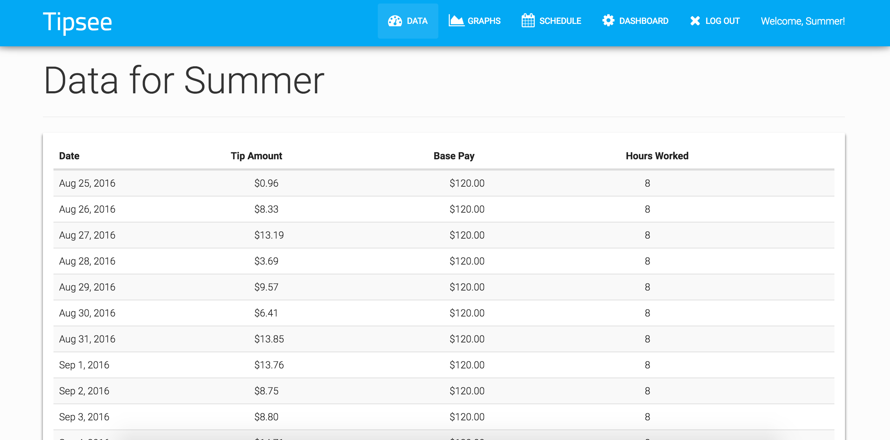
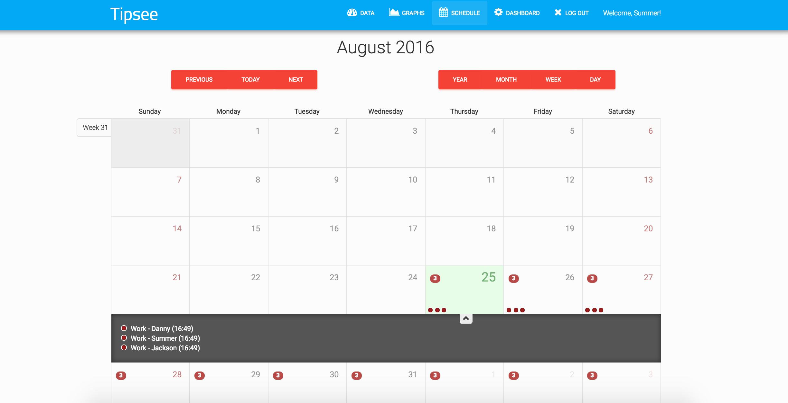

#BusBoy  

###LINK to project

 wwww.bobloblawslawblog.com

###Overview of Project

The silent hero of the service industry, BusBoy will clean up your work life so you don't have to! This site is a one stop shop for all your service industry organizational needs. The user can add their daily tips, hourly wages, and hours worked and our site will track the data via graphs and tables. Now the user not only has a catalog of their earnings over time, but will also be able to see which days they earn the most tips based on time worked and date. Our calendar feature allows the user to see what days they have to work, along with any other special events which may affect their work place. The site will include a employee and employer logins, allowing the employer to post a master schedule for the employee to review but keeping the employee and employer information(account) separate. 

###Motivation

The moment our team member Danny proposed this idea, we were all in. For people in the service industry, there is no solid site/app which can track and manage all of their needs. Initially, he proposed an app which would allow him to track the tips he recieves from bartending over a period of time. Applications he was using for this specific purpose were just not functional. These apps had bad gui, tons of bugs, and just created an overall unpleasant user experience. We decided to give Danny the application he(and many others as we've come to find ) so desperately desired. With this initial tip tracker idea in mind, we thought hey, why not make it the one stop shop for all user needs. And thus BusBoy was born.

###Built With

Angular
Bootstrap
Javascript
HTML
CSS
D3

###NPMs

npm install angular
npm install angular-cookies
npm install jquery
npm install angular-animate
npm install angular-route
npm install boostrap

###SCREENSHOTS

<!--  -->

###Things to add

*Chat feature, which will allow the user to chat with fellow employees/employer in order to create a sense of community without forcing the user to carry their job around with them on their phone. Chat will be accessible on any page as long as the user is signed in.
*Employer can post work schedules to a master schedule for the employees to access.Will alert employees of their shift/add shift to employees own calendar
*Shift changing option, allowing employees the ability to pick up and drop shifts. Shift will be posted to be grabbed, calendar will adjust with the removal/addition of a shift.

### Contributors

*Summer Adhal: https://github.com/summeradhal
*Danny Arango: http://www.dannyarango.com
*Jackson Yeager: http://volition-dev.com

